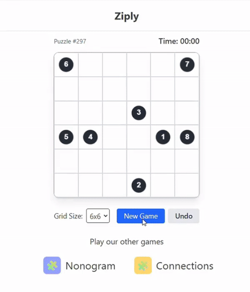

<p align="center">
  
</p>

# ziply-solver
An automated solver for the Ziply puzzle game using computer vision and various solving strategies.

## Description
`ziply-solver` automatically plays and solves the Ziply browser puzzle. It works by capturing the game board from the screen, detecting puzzle elements, reconstructing the board internally, and using various solvers to find the valid solution path. The solution is then executed in real time using `pyautogui`.

### Processing pipeline
1. Capture the active puzzle window
2. Detect all circles in the window
3. Identify the cluster representing the puzzle
4. Zoom into the puzzle region of interest (ROI)  
5. Detect puzzle board edges  
6. Extract and preprocess checkpoints  
7. Recognize checkpoint digits (OCR) and order them  
8. Convert pixel coordinates → grid coordinates  

### Solving
- The board is simulated as a 2D array.  
- A solver will find the valid path through all checkpoints.  
- Grid coordinates are mapped back to pixel coordinates.  
- `pyautogui` interacts with the browser to draw the solution automatically.

## Installation

### Using Conda
To create the environment from the provided YAML file:

```bash
conda env create -f environment.yaml
conda activate ziply-game-env
```
### Using Pip
To install dependencies from requirements.txt:

```bash
python -m venv ziply-env
```
```bash
source ziply-env/bin/activate      # macOS/Linux
```
```bash
ziply-env\Scripts\activate.bat     # Windows
```
```bash
pip install -r requirements.txt
```
If you are on MacOS, you will also need to install pyobj.
```bash
pip install -U pyobjc
```

## Usage

After installation, run the program from the root directory:
```bash
python main.py [OPTIONS]
```
You will be prompted to click the window that contains the puzzle. Once clicked, there is a one second delay until it begins solving. To solve another puzzle, you must rerun the script.

### Comand-Line Options

The following optional arguments are available to customize the script's behavior:

- --show-animation (-na): Enables the final Matplotlib animation that shows the algorithm's path.

- --no-solution (-ns): Disables the automatic drawing of the solution in the puzzle window.

- --display-coords (-dc): Prints the final solution path as a list of coordinates to the console and the board as an array.

- --sim-length N (-sl N): Animates only the first N steps of the algorithm's path. (Default: 1000)

- --show-heatmap (-hm): Show heatmap of possible intersections between checkpoints

For a full list of commands, you can always run:
```bash
python main.py --help
```
