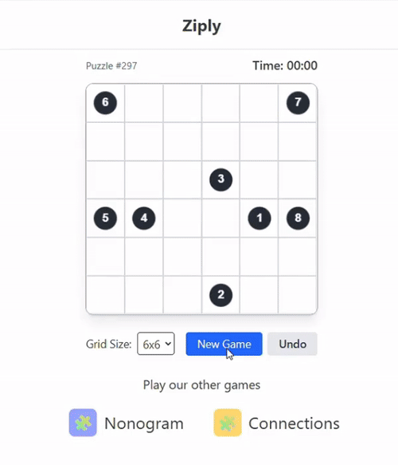

<p align="center">
  
</p>

# Ziply Solver

An experimental computer-vision and constraint-solving pipeline for the Ziply browser puzzle. It captures a puzzle from the screen, reconstructs its grid and checkpoints, searches for a valid path, and can draw the solution with desktop automation.

## What it demonstrates

- A staged OpenCV pipeline for board detection and coordinate extraction
- A small TensorFlow classifier for recognizing checkpoint numbers
- Multiple graph-search experiments, including SAT and constraint-based solvers
- Conversion between screen pixels, grid coordinates, and an automated mouse path
- Visualization tools for solver paths and intersection heatmaps

## How the pipeline works

1. Wait for the user to select the puzzle window.
2. Capture the selected window and locate the board.
3. Detect cells and checkpoint circles with OpenCV.
4. Classify the checkpoint numbers with the included Keras model.
5. Reconstruct the puzzle as a NumPy array.
6. Find a path through the checkpoints in order.
7. Optionally print, visualize, or draw the solution.

## Requirements

- Python 3.12 is the tested target
- A desktop session with permission to capture the screen and control the mouse
- Tk support when using the interactive board or Matplotlib visualizations
- X11 on Linux; Wayland is not currently supported by the automation path

This is an experimental personal project. Browser layout, display scaling, puzzle dimensions, and visual changes can affect board recognition. The current automated entry point is tuned for the dimensions configured near the start of `main()` and has primarily been exercised with 5×5 and 6×6 boards.

## Installation

### Conda

```bash
conda env create -f ziply-game-env.yaml
conda activate ziply-game-env
```

### `venv` and pip

```bash
python -m venv .venv
```

Activate it on macOS or Linux:

```bash
source .venv/bin/activate
```

Or on Windows PowerShell:

```powershell
.venv\Scripts\Activate.ps1
```

Then install the runtime dependencies:

```bash
python -m pip install -r requirements.txt
```

macOS users may also need `pyobjc` for desktop automation:

```bash
python -m pip install pyobjc
```

## Usage

Close unrelated sensitive windows before running the program: it captures the selected window and can take control of the mouse.

```bash
python main.py [OPTIONS]
```

The program waits for a click on the target window and then begins processing after a short delay. Use `--no-solution` while testing recognition so the program does not control the mouse.

| Option | Short form | Purpose |
| --- | --- | --- |
| `--show-animation` | `-sa` | Display a final path animation. |
| `--no-solution` | `-ns` | Do not draw the solution in the selected window. |
| `--display-coords` | `-dc` | Print the reconstructed board and solution coordinates. |
| `--show-heatmap` | `-hm` | Display an intersection heatmap. |
| `--trouble-shoot` | `-ts` | Show additional OCR-pipeline diagnostics. |
| `--sim-length N` | `-sl N` | Limit the solver simulation to the first `N` steps. |

Run `python main.py --help` for the authoritative CLI help.

## Other entry points

- `interactive_solver.py` renders local boards for solver experiments.
- `standalone_solver.py` runs solver checks against the sample `.npz` boards.
- `board_generator.py` generates boards for local experiments.
- `OCR Model/custom_model_trainer.py` retrains the OCR model from a local dataset.

The training images are intentionally not stored in Git. To retrain the model, supply a directory containing numbered class folders and install the optional dependencies:

```bash
python -m pip install -r requirements-training.txt
python "OCR Model/custom_model_trainer.py" PATH_TO_TRAINING_DATA --output mnist_custom_digits.keras
```

## Repository layout

```text
solvers/                 Path-search implementations
utils/                   Platform and command-line helpers
visualization_utils/     Animation and heatmap tools
custom_boards/           Small sample boards for solver experiments
OCR Model/               OCR training script (dataset excluded)
mnist_custom_digits.keras Runtime OCR model
```

## Development

The lightweight checks do not require the computer-vision stack:

```bash
python -m unittest discover -s tests -v
python -m compileall -q .
```

## Responsible use

Only automate software and accounts you are authorized to control. Review the rules of any site or game before using desktop automation. This repository is an educational experiment, not a supported service or a promise of compatibility with any third-party product.

## License

[MIT](LICENSE)
